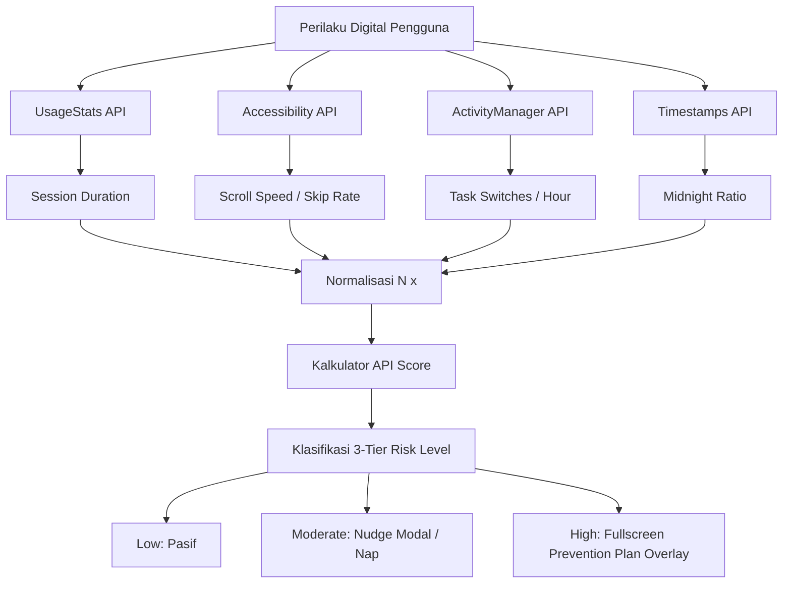

# Attention Guard 🛡️

**Attention Guard** adalah framework *passive behavioral sensing* berbasis Android dan Web yang dirancang untuk menjaga kesejahteraan digital (*digital wellbeing*) pengguna dengan memitigasi fragmentasi perhatian, distraksi kognitif, dan perilaku scrolling kompulsif. Aplikasi ini mengintegrasikan telemetri sistem tingkat rendah dengan desain antarmuka berbasis **Meta Design System** untuk memberikan intervensi tepat waktu tanpa mengganggu produktivitas pengguna.

---

## 1. Latar Belakang Riset

Aplikasi mobile modern sering kali dirancang menggunakan pola desain persuasif (*persuasive design patterns*) seperti *infinite scrolling*, putar otomatis (*auto-play*), dan notifikasi algoritmik yang agresif. Pola-pola ini memicu pelepasan dopamin secara instan, sehingga mendorong pengguna ke dalam siklus penggunaan kompulsif (*compulsive scrolling*) dan pergantian tugas secara cepat (*frantic switching*). Akibatnya, pengguna mengalami kelelahan kognitif (*cognitive fatigue*), penurunan fokus mendalam (*deep work*), dan gangguan pola tidur.

Metode pelacakan *screentime* tradisional saat ini terlalu sederhana karena hanya menghitung total durasi penggunaan harian tanpa mempertimbangkan kualitas dan dinamika interaksi. 

Riset dalam proyek ini memperkenalkan **Attention Guard**, sebuah pendekatan pemantauan pasif yang mendeteksi beban kerja kognitif secara real-time. Sistem ini menggunakan arsitektur **CNN-LSTM (Convolutional Neural Network - Long Short-Term Memory)** untuk menganalisis data deret waktu (*sequence analysis*) dari pola interaksi pengguna. 
- **Convolutional Neural Network (CNN)** mengekstrak fitur spasial dari data mikro-interaksi individual (kecepatan gulir, durasi sentuhan, transisi aplikasi).
- **Long Short-Term Memory (LSTM)** memodelkan ketergantungan temporal jangka panjang untuk mendeteksi apakah pengguna sedang berada dalam kondisi fokus atau sedang terjebak dalam perilaku scrolling kompulsif (*doomscrolling*).

---

## 2. Arsitektur 4-Stage Pipeline

Attention Guard mengalirkan telemetri sensor perilaku pengguna melalui **4-Stage Pipeline** pasif yang memetakan aktivitas digital ke dalam metrik kognitif:



### Stage 1: UsageStats (Session Duration)
*   **Sensor**: `UsageStatsManager` (Android System Service).
*   **Parameter**: Total durasi waktu aplikasi berada di latar depan (*foreground*) dalam satuan jam.
*   **Signifikansi**: Mengidentifikasi sesi penggunaan yang berjalan terlalu lama dan melebihi batas toleransi harian (dinormalisasi dengan batas maksimum $8.0$ jam per hari).

### Stage 2: Accessibility (Scroll Velocity & Skip Rate)
*   **Sensor**: `AttentionAccessibilityService` (mengamati event `TYPE_VIEW_SCROLLED`).
*   **Parameter**: Mengukur kecepatan gulir halaman (*Scroll Speed*) dan rasio konten yang dilewati begitu saja tanpa dibaca (*Content Skip Rate*).
*   **Signifikansi**: Kecepatan gulir yang sangat tinggi dan tidak teratur (*frantic scrolling*) serta tingkat *skip* konten yang tinggi mengindikasikan hilangnya konsentrasi dan pencarian dopamin impulsif (misalnya pada konten video pendek).

### Stage 3: ActivityManager (Task Switches)
*   **Sensor**: Pemantauan transisi aplikasi dan siklus hidup aktivitas.
*   **Parameter**: Frekuensi perpindahan aplikasi per jam (*App Switches/Hour*).
*   **Signifikansi**: Mengidentifikasi perilaku multitasking yang berlebihan (*scattered attention*). Perpindahan aplikasi yang terlalu sering (dinormalisasi dengan batas maksimum $20$ kali per jam) menunjukkan fragmentasi fokus.

### Stage 4: Timestamps (Midnight Ratio)
*   **Sensor**: Pelacakan waktu sistem log aktivitas harian.
*   **Parameter**: Rasio durasi penggunaan aplikasi pasca-tengah malam (pukul 00.00 – 06.00) dibandingkan dengan total penggunaan harian.
*   **Signifikansi**: Menangkap kerentanan penggunaan malam hari (*late-night vulnerability*). Rasio penggunaan malam yang tinggi berkorelasi langsung dengan insomnia dan penurunan kontrol diri.

---

## 3. Rumus API Score (Attention Performance Indicator)

**API Score** menggambarkan tingkat beban kognitif dan kelelahan perhatian pengguna dalam rentang nilai $0.00$ (Fokus Sempurna) hingga $1.00$ (Kelelahan Ekstrim/Kompulsif).

### Tahap 1: Normalisasi Metrik $N(x)$
Sebelum dihitung, setiap metrik masukan dinormalisasi menjadi rentang $[0.0, 1.0]$:

1.  **Normalisasi Durasi Sesi ($N_{\text{session}}$)**:
    $$N_{\text{session}} = \min\left(1.0, \max\left(0.0, \frac{\text{Durasi Sesi (Jam)}}{8.0}\right)\right)$$

2.  **Normalisasi Kecepatan Gulir ($N_{\text{scroll}}$)**:
    $$N_{\text{scroll}} = \min\left(1.0, \max\left(0.0, \frac{\text{Kecepatan Gulir (px/s)}}{250.0}\right)\right)$$

3.  **Normalisasi Perpindahan Tugas ($N_{\text{switch}}$)**:
    $$N_{\text{switch}} = \min\left(1.0, \max\left(0.0, \frac{\text{Perpindahan / Jam}}{20.0}\right)\right)$$

4.  **Normalisasi Penggunaan Malam Hari ($N_{\text{night}}$)**:
    $$N_{\text{night}} = \min(1.0, \max(0.0, \text{Rasio Malam}))$$

### Tahap 2: Formula Pembobotan API Score
Skor API akhir dihitung dengan menjumlahkan metrik yang ternormalisasi dengan bobot kepentingan sebagai berikut:

$$\text{API Score} = 0.30 \cdot N_{\text{session}} + 0.20 \cdot N_{\text{scroll}} + 0.30 \cdot N_{\text{switch}} + 0.20 \cdot N_{\text{night}}$$

*Catatan: Skor akhir dibulatkan hingga 2 digit di belakang desimal.*

---

## 4. 3-Tier Risk Level

Sistem mengklasifikasikan tingkat risiko perhatian pengguna berdasarkan nilai **API Score** yang diperoleh untuk menentukan tindakan perlindungan yang relevan:

| Risk Tier | Rentang API Score | Deskripsi Kondisi | Tindakan / Intervensi Sistem |
| :--- | :--- | :--- | :--- |
| **Low Risk** (Hijau/Biru) | $\text{API Score} < 0.35$ | Pengguna menunjukkan kendali diri yang baik, sesi terarah, dan kecepatan interaksi stabil. | Pemantauan pasif tanpa gangguan. Dashboard menampilkan indikator status tenang. |
| **Moderate Risk** (Kuning) | $0.35 \le \text{API Score} < 0.65$ | Indikasi awal kelelahan perhatian, seperti durasi sesi memanjang atau mulai scrolling lebih cepat. | Sistem memberikan dorongan halus (*Micro-nudge*). Muncul notifikasi atau bottom modal menyarankan jeda bernapas (*breathing session*) atau meditasi 5 menit. |
| **High Risk** (Merah) | $\text{API Score} \ge 0.65$ | Penggunaan kompulsif akut, *doomscrolling* intens, pergantian aplikasi sangat cepat, atau penggunaan larut malam yang parah. | Intervensi aktif. Sistem memicu modal pemblokiran layar penuh (*Prevention Plan Overlay*) untuk menghentikan kebiasaan kompulsif secara paksa dan mengarahkan pengguna ke aktivitas fisik/detoks digital. |

---

## 5. Panduan Arsitektur Meta Design System

Attention Guard mengadopsi standar **Meta Design System** (mengacu pada panduan visual perangkat keras Meta VR/Ray-Ban dan e-commerce hardware) untuk menciptakan antarmuka yang bersih, premium, dan informatif.

### A. Filosofi White Canvas
Desain menggunakan latar belakang putih bersih (`#ffffff` atau `#f9f9fd`) yang luas untuk mengurangi distorsi kognitif. Antarmuka bertindak sebagai "panggung minimalis" yang menonjolkan visual data, grafik kemajuan, dan tombol intervensi secara dramatis.

### B. Palet Warna (Color System)
*   **Brand / Action Primary**: `Cobalt Blue` (`#0064E0` atau `#004db0`) - digunakan untuk tombol konfirmasi utama, visual pengukur aktif, dan tab navigasi terpilih.
*   **Brand Secondary**: `Facebook Blue` (`#1876F2`) - digunakan untuk tautan aktif dan elemen interaktif tingkat kedua.
*   **Surfaces & Containers**:
    *   `Surface Soft`: `#F1F4F7` / `#f3f3f7` (digunakan pada bento box rekomendasi dan input fields).
    *   `Lowest Container`: `#ffffff` (digunakan untuk kartu statistik latar belakang).
*   **Borders & Hairlines**:
    *   `Hairline`: `#CED0D4` (border 1px tipis untuk kartu).
    *   `Hairline Soft`: `#DEE3E9` (pembatas halus antar elemen teks).
*   **Status Indicators**:
    *   `Success` (Low Risk): `#31a24c`
    *   `Warning` (Moderate Risk): `#f2a918` / `#F7B928`
    *   `Critical` (High Risk): `#e41e3f` / `#f0284a`

### C. Tipografi (Typography)
Menggunakan keluarga font **Optimistic VF** atau **Be Vietnam Pro** dengan hierarki ketat tiga lapis untuk efisiensi keterbacaan:
1.  **Display (Display-LG / Hero)**: Ukuran $48\text{px} - 64\text{px}$ dengan ketebalan Medium (`500`). Digunakan khusus untuk menampilkan angka API Score secara dominan.
2.  **Sub-headings (Subtitle-LG / Heading-SM)**: Ukuran $18\text{px} - 24\text{px}$ Bold/Medium. Digunakan untuk nama metrik dan judul modul bento box.
3.  **Body & Caption (Body-MD / Caption)**: Ukuran $12\text{px} - 16\text{px}$ Regular. Digunakan untuk penjelasan deskriptif, label API, dan keterpencetannya.

### D. Bentuk & Sudut Kelengkungan (Shapes & Radius)
*   **Pill Rounded (100px / Full)**: Digunakan untuk tombol tindakan (*CTA*) utama, chip status filter, dan pill indikator fokus teratas.
*   **Generous Card Rounding (16px to 32px)**:
    *   `xl` ($16\text{px}$): Digunakan untuk kartu metrik grid individu (Session, Scroll, Switches, Night).
    *   `xxxl` ($32\text{px}$): Digunakan untuk komponen utama bento box rekomendasi perhatian dan kartu grafik utama.

---

## 6. Struktur Repositori

```text
Attention-Guard/
├── app/                              # Kode Sumber Android (Kotlin + Jetpack Compose)
│   ├── src/main/java/com/attentionguard/
│   │   ├── service/                  # Layanan Sensor Pasif (UsageStats & Accessibility)
│   │   ├── ui/                       # Komponen Tampilan (Compose Screens, Theme, Modals)
│   │   └── MainActivity.kt           # Titik Masuk Utama Android & Inisialisasi Layanan
│   └── src/main/res/                 # Konfigurasi XML (Accessibility Service Settings)
│
├── attention_guard_settings/         # Halaman Pengaturan Perilaku (HTML Mockup)
├── behavioral_alert_modal/           # Halaman Nudge Intervensi Ringan (HTML Mockup)
├── behavioral_analytics_patterns/    # Tampilan Pola Grafis Perhatian (HTML Mockup)
├── mindstate_dashboard/              # Dashboard Utama Pengguna (HTML Mockup)
├── prevention_plan/                  # Detoks/Wellness Plan Action (HTML Mockup)
├── prevention_plan_overlay/          # Overlay Pemblokiran Layar Penuh (HTML Mockup)
├── web-backup/                       # Integrasi Antarmuka Web Utama (Index + app.js)
├── design_meta.md                    # Dokumentasi Tokens & Tokens JSON Meta Design System
└── build.gradle                      # Konfigurasi Pembangunan Proyek Gradle
```

---

## 7. Cara Menjalankan Proyek

### Menjalankan Aplikasi Android
1.  Buka direktori `/` atau impor folder `Attention-Guard` menggunakan **Android Studio**.
2.  Pastikan SDK Android minimal adalah API 26 (Android 8.0) ke atas (target API 34).
3.  Build dan jalankan pada emulator atau perangkat fisik Android.
4.  **PENTING**: Aktifkan izin berikut setelah instalasi:
    *   *Usage Access Permission* (untuk mendeteksi waktu sesi aplikasi via `UsageStats`).
    *   *Accessibility Service Permission* (untuk mendeteksi kecepatan scroll halaman via `AttentionAccessibilityService`).

### Menjalankan Dashboard Web
1.  Buka berkas `web-backup/index.html` langsung di browser web Anda (Chrome/Safari/Edge).
2.  Anda dapat menggunakan *Local Web Server* (misalnya ekstensi VS Code *Live Server* or `python -m http.server`) untuk memvisualisasikan interaksi transisi layar dan simulasi perubahan data sensor.
